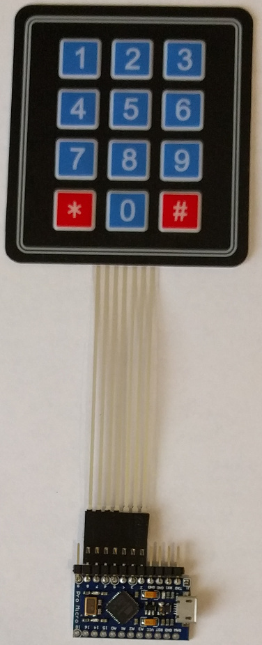

# Stick-on Twelve Button USB MIDI Controller

Sometimes your gear really needs some MIDI control buttons strategically
located. Now you can stick them on where needed.

## Hardware

* SparkFun Pro Micro or Arduino Micro

These boards are convenient because the pin arrangment includes a section with
seven digital pins in a row. The cable from the keypad can be plugged directly into
that section of the board. Other boards with the ATMEGA32U4 chip should work
but might require extra work to wire the keypad to the board.

The photo shows a Pro Micro clone board. Right angle headers are used to keep
the assembly as flat as possible. After soldering, the pins on the back were
cut flush with the board.

* Generic 12 button membrane keypad

Stick on where needed. But it may not be easy to remove so think twice before
sticking. Peel off the white paper on the back to uncover the adhesive. The
Arduino board can be stuck on using double-sided foam tape. This stuff is also
hard to remove.

## Software

Install the Keypad, MIDIUSB, and MIDI libraries using the Arduino IDE library
manager.

The sketch can be customized to send MIDI messages.

NOTE: System Exclusve arrays should be stored in program memory using the
PROGMEM attribute then sent using the USBSystemExclusive_P function. If not,
RAM will be quickly used up.

## Related Projects

Four button MIDI USB controller.

https://github.com/gdsports/buttons4

101 button MIDI DIN controller.

https://github.com/gdsports/USBHIDKbd2MIDI
